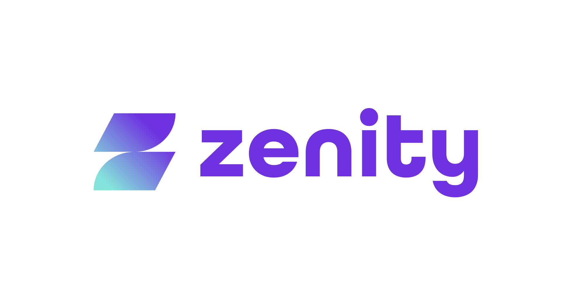

## 寄稿者

プロジェクトに多大な貢献をした個人。

| 氏名 | 貢献内容 | 所属 | 連絡先 |
| --- | --- | --- | --- |
| Michael Bargury | Project founder | Zenity | [Twitter](https://twitter.com/mbrg0) [LinkedIn](https://www.linkedin.com/in/michaelbargury/) |
| Ory Segal | Project founder and leader | Palo Alto Networks | [Twitter](https://twitter.com/orysegal) [LinkedIn](https://www.linkedin.com/in/orysegal/) |
| Don Willits | Core contributor | Microsoft | [LinkedIn](https://www.linkedin.com/in/don-willits-9081835/) |
| John McTiernan | Core contributor | DT Group | [LinkedIn](https://www.linkedin.com/in/john-mctiernan/) |
| Yianna Paris | Core contributor | Xebia | [LinkedIn](https://www.linkedin.com/in/salted-hash/) |
| Kayla Underkoffler | Project leader | Zenity | [LinkedIn](https://www.linkedin.com/in/kayla-underkoffler-7400673a/) |
| Ziv Daniel Hagbi | Project leader | Zenity | [LinkedIn](https://www.linkedin.com/in/ziv-hagbi/) |

## スポンサー

OWASP Top 10 ローコード/ノーコードセキュリティリスクは [Zenity](https://www.zenity.io/) の支援を受けています。
 

